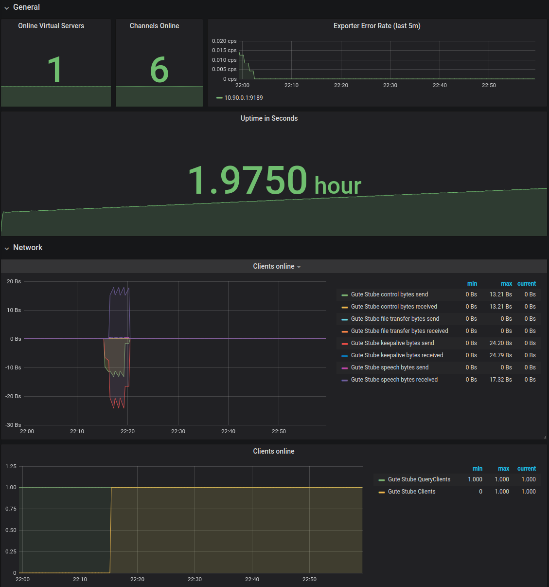

# TS3 Exporter
 

This exporter uses the server query protocol to provide prometheus metrics.

The `contrib` directory contains a grafana dashboard and an ansible role to install
the exporter. 

## Build
The build is tested with go version 1.14. Since the build uses new standard error formatting, it requires at least 1.13.
```bash
go build
```

## Usage
``` 
# ./ts3exporter -h
Usage of /ts3exporter:
  -enablechannelmetrics
    	Enables the channel collector.
  -ignorefloodlimits
    	Disable the server query flood limiter. Use this only if your exporter is whitelisted in the query_ip_whitelist.txt file.
  -listen string
    	listen address of the exporter (default ":9189")
  -passwordfile string
    	file containing the password. Must have 0600 permission. The file is not read if the environment variable SERVERQUERY_PASSWORD is set. (default "/etc/ts3exporter/password")
  -remote string
    	remote address of server query port (default "localhost:10011")
  -user string
    	the serverquery user of the ts3exporter (default "serveradmin")
```

## Channel Metrics
The exporter can produce per channel metrics. The channel metrics are disabled by default, since the channel metrics produce a high number of 
server query commands. The current formular is `(2 + NumberOfChannels) * NumberOfVServer` server query commands. The default server
query flood limit is 10 commands per 3 seconds. To not run into that limit, the exporter reads the limit at login time and 
throttles itself below that. The default results in one server query command every 300ms.
Using the default flood limit and a vServer with 10 channels we get the following scrape time:
```text
(2 * 10)*1 * 300ms = 6s
```
The `serverinfo` metrics collector produces `1 + NumberOfVServer*2` 
serverquery commands. In our example that adds additional 900ms.
Since we update the metrics if the prometheus server calls the `/metrics`
endpoint, the scrape timeout must be at least 7 seconds. 

### Workarounds
To speed up the scraping you can increase the server query flood limits or add the IP of your exporter to the
`query_ip_whitelist.txt` file. If your exporter IP is added to the whitelist file, set the option `-ignorefloodlimits` to 
disable the limiter.

## Examples:
```bash
# curl localhost:9189/metrics
# HELP go_gc_duration_seconds A summary of the pause duration of garbage collection cycles.
# TYPE go_gc_duration_seconds summary
go_gc_duration_seconds{quantile="0"} 1.698e-05
go_gc_duration_seconds{quantile="0.25"} 3.408e-05
go_gc_duration_seconds{quantile="0.5"} 5.1118e-05
go_gc_duration_seconds{quantile="0.75"} 6.9587e-05
go_gc_duration_seconds{quantile="1"} 0.001707146
go_gc_duration_seconds_sum 1.463852829
go_gc_duration_seconds_count 11922
# HELP go_goroutines Number of goroutines that currently exist.
# TYPE go_goroutines gauge
go_goroutines 8
# HELP go_info Information about the Go environment.
# TYPE go_info gauge
go_info{version="go1.14.1"} 1
# HELP go_memstats_alloc_bytes Number of bytes allocated and still in use.
# TYPE go_memstats_alloc_bytes gauge
go_memstats_alloc_bytes 1.75364e+06
# HELP go_memstats_alloc_bytes_total Total number of bytes allocated, even if freed.
# TYPE go_memstats_alloc_bytes_total counter
go_memstats_alloc_bytes_total 7.34215948e+09
# HELP go_memstats_buck_hash_sys_bytes Number of bytes used by the profiling bucket hash table.
# TYPE go_memstats_buck_hash_sys_bytes gauge
go_memstats_buck_hash_sys_bytes 1.559157e+06
# HELP go_memstats_frees_total Total number of frees.
# TYPE go_memstats_frees_total counter
go_memstats_frees_total 8.6240099e+07
# HELP go_memstats_gc_cpu_fraction The fraction of this program's available CPU time used by the GC since the program started.
# TYPE go_memstats_gc_cpu_fraction gauge
go_memstats_gc_cpu_fraction 5.10060424459526e-06
# HELP go_memstats_gc_sys_bytes Number of bytes used for garbage collection system metadata.
# TYPE go_memstats_gc_sys_bytes gauge
go_memstats_gc_sys_bytes 3.574024e+06
# HELP go_memstats_heap_alloc_bytes Number of heap bytes allocated and still in use.
# TYPE go_memstats_heap_alloc_bytes gauge
go_memstats_heap_alloc_bytes 1.75364e+06
# HELP go_memstats_heap_idle_bytes Number of heap bytes waiting to be used.
# TYPE go_memstats_heap_idle_bytes gauge
go_memstats_heap_idle_bytes 6.4495616e+07
# HELP go_memstats_heap_inuse_bytes Number of heap bytes that are in use.
# TYPE go_memstats_heap_inuse_bytes gauge
go_memstats_heap_inuse_bytes 2.2528e+06
# HELP go_memstats_heap_objects Number of allocated objects.
# TYPE go_memstats_heap_objects gauge
go_memstats_heap_objects 7218
# HELP go_memstats_heap_released_bytes Number of heap bytes released to OS.
# TYPE go_memstats_heap_released_bytes gauge
go_memstats_heap_released_bytes 6.434816e+07
# HELP go_memstats_heap_sys_bytes Number of heap bytes obtained from system.
# TYPE go_memstats_heap_sys_bytes gauge
go_memstats_heap_sys_bytes 6.6748416e+07
# HELP go_memstats_last_gc_time_seconds Number of seconds since 1970 of last garbage collection.
# TYPE go_memstats_last_gc_time_seconds gauge
go_memstats_last_gc_time_seconds 1.5870692326684217e+09
# HELP go_memstats_lookups_total Total number of pointer lookups.
# TYPE go_memstats_lookups_total counter
go_memstats_lookups_total 0
# HELP go_memstats_mallocs_total Total number of mallocs.
# TYPE go_memstats_mallocs_total counter
go_memstats_mallocs_total 8.6247317e+07
# HELP go_memstats_mcache_inuse_bytes Number of bytes in use by mcache structures.
# TYPE go_memstats_mcache_inuse_bytes gauge
go_memstats_mcache_inuse_bytes 1736
# HELP go_memstats_mcache_sys_bytes Number of bytes used for mcache structures obtained from system.
# TYPE go_memstats_mcache_sys_bytes gauge
go_memstats_mcache_sys_bytes 16384
# HELP go_memstats_mspan_inuse_bytes Number of bytes in use by mspan structures.
# TYPE go_memstats_mspan_inuse_bytes gauge
go_memstats_mspan_inuse_bytes 31416
# HELP go_memstats_mspan_sys_bytes Number of bytes used for mspan structures obtained from system.
# TYPE go_memstats_mspan_sys_bytes gauge
go_memstats_mspan_sys_bytes 65536
# HELP go_memstats_next_gc_bytes Number of heap bytes when next garbage collection will take place.
# TYPE go_memstats_next_gc_bytes gauge
go_memstats_next_gc_bytes 4.194304e+06
# HELP go_memstats_other_sys_bytes Number of bytes used for other system allocations.
# TYPE go_memstats_other_sys_bytes gauge
go_memstats_other_sys_bytes 372099
# HELP go_memstats_stack_inuse_bytes Number of bytes in use by the stack allocator.
# TYPE go_memstats_stack_inuse_bytes gauge
go_memstats_stack_inuse_bytes 360448
# HELP go_memstats_stack_sys_bytes Number of bytes obtained from system for stack allocator.
# TYPE go_memstats_stack_sys_bytes gauge
go_memstats_stack_sys_bytes 360448
# HELP go_memstats_sys_bytes Number of bytes obtained from system.
# TYPE go_memstats_sys_bytes gauge
go_memstats_sys_bytes 7.2696064e+07
# HELP go_threads Number of OS threads created.
# TYPE go_threads gauge
go_threads 6
# HELP process_cpu_seconds_total Total user and system CPU time spent in seconds.
# TYPE process_cpu_seconds_total counter
process_cpu_seconds_total 265.54
# HELP process_max_fds Maximum number of open file descriptors.
# TYPE process_max_fds gauge
process_max_fds 1024
# HELP process_open_fds Number of open file descriptors.
# TYPE process_open_fds gauge
process_open_fds 11
# HELP process_resident_memory_bytes Resident memory size in bytes.
# TYPE process_resident_memory_bytes gauge
process_resident_memory_bytes 1.0235904e+07
# HELP process_start_time_seconds Start time of the process since unix epoch in seconds.
# TYPE process_start_time_seconds gauge
process_start_time_seconds 1.58548645539e+09
# HELP process_virtual_memory_bytes Virtual memory size in bytes.
# TYPE process_virtual_memory_bytes gauge
process_virtual_memory_bytes 1.039458304e+09
# HELP process_virtual_memory_max_bytes Maximum amount of virtual memory available in bytes.
# TYPE process_virtual_memory_max_bytes gauge
process_virtual_memory_max_bytes -1
# HELP promhttp_metric_handler_requests_in_flight Current number of scrapes being served.
# TYPE promhttp_metric_handler_requests_in_flight gauge
promhttp_metric_handler_requests_in_flight 1
# HELP promhttp_metric_handler_requests_total Total number of scrapes by HTTP status code.
# TYPE promhttp_metric_handler_requests_total counter
promhttp_metric_handler_requests_total{code="200"} 26383
promhttp_metric_handler_requests_total{code="500"} 0
promhttp_metric_handler_requests_total{code="503"} 0
# HELP ts3_channel_clients_online number of clients currently online
# TYPE ts3_channel_clients_online gauge
ts3_channel_clients_online{channel="AoE",virtualserver="Gute Stube"} 0
ts3_channel_clients_online{channel="Apex Legends",virtualserver="Gute Stube"} 0
ts3_channel_clients_online{channel="Betafield",virtualserver="Gute Stube"} 0
ts3_channel_clients_online{channel="Default Channel",virtualserver="Gute Stube"} 2
ts3_channel_clients_online{channel="Foobar",virtualserver="Gute Stube"} 0
ts3_channel_clients_online{channel="AFK",virtualserver="Gute Stube"} 0
ts3_channel_clients_online{channel="Another Channel",virtualserver="Gute Stube"} 0
# HELP ts3_channel_codec numeric number of configured codec for this channel
# TYPE ts3_channel_codec gauge
ts3_channel_codec{channel="AoE",virtualserver="Gute Stube"} 4
ts3_channel_codec{channel="Apex Legends",virtualserver="Gute Stube"} 4
ts3_channel_codec{channel="Betafield",virtualserver="Gute Stube"} 4
ts3_channel_codec{channel="Default Channel",virtualserver="Gute Stube"} 4
ts3_channel_codec{channel="Foobar",virtualserver="Gute Stube"} 4
ts3_channel_codec{channel="AFK",virtualserver="Gute Stube"} 4
ts3_channel_codec{channel="Another Channel",virtualserver="Gute Stube"} 4
# HELP ts3_channel_codec_latency_factor numeric number of codec latency factor chosen for this channel
# TYPE ts3_channel_codec_latency_factor gauge
ts3_channel_codec_latency_factor{channel="AoE",virtualserver="Gute Stube"} 1
ts3_channel_codec_latency_factor{channel="Apex Legends",virtualserver="Gute Stube"} 1
ts3_channel_codec_latency_factor{channel="Betafield",virtualserver="Gute Stube"} 1
ts3_channel_codec_latency_factor{channel="Default Channel",virtualserver="Gute Stube"} 1
ts3_channel_codec_latency_factor{channel="Foobar",virtualserver="Gute Stube"} 1
ts3_channel_codec_latency_factor{channel="AFK",virtualserver="Gute Stube"} 1
ts3_channel_codec_latency_factor{channel="Another Channel",virtualserver="Gute Stube"} 1
# HELP ts3_channel_codec_quality numeric number of codec quality level chosen for this channel
# TYPE ts3_channel_codec_quality gauge
ts3_channel_codec_quality{channel="AoE",virtualserver="Gute Stube"} 10
ts3_channel_codec_quality{channel="Apex Legends",virtualserver="Gute Stube"} 10
ts3_channel_codec_quality{channel="Betafield",virtualserver="Gute Stube"} 10
ts3_channel_codec_quality{channel="Default Channel",virtualserver="Gute Stube"} 10
ts3_channel_codec_quality{channel="Foobar",virtualserver="Gute Stube"} 10
ts3_channel_codec_quality{channel="AFK",virtualserver="Gute Stube"} 10
ts3_channel_codec_quality{channel="Another Channel",virtualserver="Gute Stube"} 10
# HELP ts3_channel_default is the channel the default channel
# TYPE ts3_channel_default gauge
ts3_channel_default{channel="AoE",virtualserver="Gute Stube"} 0
ts3_channel_default{channel="Apex Legends",virtualserver="Gute Stube"} 0
ts3_channel_default{channel="Betafield",virtualserver="Gute Stube"} 0
ts3_channel_default{channel="Default Channel",virtualserver="Gute Stube"} 1
ts3_channel_default{channel="Foobar",virtualserver="Gute Stube"} 0
ts3_channel_default{channel="AFK",virtualserver="Gute Stube"} 0
ts3_channel_default{channel="Another Channel",virtualserver="Gute Stube"} 0
# HELP ts3_channel_max_clients maximal number of clients allowed in this channel
# TYPE ts3_channel_max_clients gauge
ts3_channel_max_clients{channel="AoE",virtualserver="Gute Stube"} -1
ts3_channel_max_clients{channel="Apex Legends",virtualserver="Gute Stube"} -1
ts3_channel_max_clients{channel="Betafield",virtualserver="Gute Stube"} -1
ts3_channel_max_clients{channel="Default Channel",virtualserver="Gute Stube"} -1
ts3_channel_max_clients{channel="Foobar",virtualserver="Gute Stube"} -1
ts3_channel_max_clients{channel="AFK",virtualserver="Gute Stube"} -1
ts3_channel_max_clients{channel="Another Channel",virtualserver="Gute Stube"} -1
# HELP ts3_channel_password is the channel saved by an password
# TYPE ts3_channel_password gauge
ts3_channel_password{channel="AoE",virtualserver="Gute Stube"} 0
ts3_channel_password{channel="Apex Legends",virtualserver="Gute Stube"} 0
ts3_channel_password{channel="Betafield",virtualserver="Gute Stube"} 0
ts3_channel_password{channel="Default Channel",virtualserver="Gute Stube"} 0
ts3_channel_password{channel="Foobar",virtualserver="Gute Stube"} 0
ts3_channel_password{channel="AFK",virtualserver="Gute Stube"} 0
ts3_channel_password{channel="Another Channel",virtualserver="Gute Stube"} 0
# HELP ts3_channel_permanent is the channel permanent
# TYPE ts3_channel_permanent gauge
ts3_channel_permanent{channel="AoE",virtualserver="Gute Stube"} 1
ts3_channel_permanent{channel="Apex Legends",virtualserver="Gute Stube"} 1
ts3_channel_permanent{channel="Betafield",virtualserver="Gute Stube"} 1
ts3_channel_permanent{channel="Default Channel",virtualserver="Gute Stube"} 1
ts3_channel_permanent{channel="Foobar",virtualserver="Gute Stube"} 1
ts3_channel_permanent{channel="AFK",virtualserver="Gute Stube"} 1
ts3_channel_permanent{channel="Another Channel",virtualserver="Gute Stube"} 1
# HELP ts3_channel_semi_permanent is the channel semi permanent
# TYPE ts3_channel_semi_permanent gauge
ts3_channel_semi_permanent{channel="AoE",virtualserver="Gute Stube"} 0
ts3_channel_semi_permanent{channel="Apex Legends",virtualserver="Gute Stube"} 0
ts3_channel_semi_permanent{channel="Betafield",virtualserver="Gute Stube"} 0
ts3_channel_semi_permanent{channel="Default Channel",virtualserver="Gute Stube"} 0
ts3_channel_semi_permanent{channel="Foobar",virtualserver="Gute Stube"} 0
ts3_channel_semi_permanent{channel="AFK",virtualserver="Gute Stube"} 0
ts3_channel_semi_permanent{channel="Another Channel",virtualserver="Gute Stube"} 0
# HELP ts3_channel_unencrypted is the channel unencrypted
# TYPE ts3_channel_unencrypted gauge
ts3_channel_unencrypted{channel="AoE",virtualserver="Gute Stube"} 1
ts3_channel_unencrypted{channel="Apex Legends",virtualserver="Gute Stube"} 1
ts3_channel_unencrypted{channel="Betafield",virtualserver="Gute Stube"} 1
ts3_channel_unencrypted{channel="Default Channel",virtualserver="Gute Stube"} 1
ts3_channel_unencrypted{channel="Foobar",virtualserver="Gute Stube"} 1
ts3_channel_unencrypted{channel="AFK",virtualserver="Gute Stube"} 1
ts3_channel_unencrypted{channel="Another Channel",virtualserver="Gute Stube"} 1
# HELP ts3_client_commands_failed_total total failed server query command
# TYPE ts3_client_commands_failed_total counter
ts3_client_commands_failed_total 0
# HELP ts3_client_commands_successful_total total successful server query command
# TYPE ts3_client_commands_successful_total counter
ts3_client_commands_successful_total 316608
# HELP ts3_exporter_data_model_refresh_errors_total Errors encountered while updating the internal server model
# TYPE ts3_exporter_data_model_refresh_errors_total counter
ts3_exporter_data_model_refresh_errors_total 0
# HELP ts3_serverinfo_bytes_received_total total received bytes
# TYPE ts3_serverinfo_bytes_received_total counter
ts3_serverinfo_bytes_received_total{virtualserver="Gute Stube"} 7.8582952e+07
# HELP ts3_serverinfo_bytes_send_total total send bytes
# TYPE ts3_serverinfo_bytes_send_total counter
ts3_serverinfo_bytes_send_total{virtualserver="Gute Stube"} 1.20887949e+08
# HELP ts3_serverinfo_channels_online number of online channels
# TYPE ts3_serverinfo_channels_online gauge
ts3_serverinfo_channels_online{virtualserver="Gute Stube"} 7
# HELP ts3_serverinfo_client_connections currently established client connections
# TYPE ts3_serverinfo_client_connections gauge
ts3_serverinfo_client_connections{virtualserver="Gute Stube"} 19
# HELP ts3_serverinfo_clients_online number of currently online clients
# TYPE ts3_serverinfo_clients_online gauge
ts3_serverinfo_clients_online{virtualserver="Gute Stube"} 2
# HELP ts3_serverinfo_control_bytes_received_total total received bytes for control traffic
# TYPE ts3_serverinfo_control_bytes_received_total counter
ts3_serverinfo_control_bytes_received_total{virtualserver="Gute Stube"} 2.004888e+06
# HELP ts3_serverinfo_control_bytes_sent_total total sent bytes for control traffic
# TYPE ts3_serverinfo_control_bytes_sent_total counter
ts3_serverinfo_control_bytes_sent_total{virtualserver="Gute Stube"} 4.607021e+06
# HELP ts3_serverinfo_file_transfer_bytes_received_total total received bytes for file transfers
# TYPE ts3_serverinfo_file_transfer_bytes_received_total counter
ts3_serverinfo_file_transfer_bytes_received_total{virtualserver="Gute Stube"} 0
# HELP ts3_serverinfo_file_transfer_bytes_sent_total total sent bytes for file transfers
# TYPE ts3_serverinfo_file_transfer_bytes_sent_total counter
ts3_serverinfo_file_transfer_bytes_sent_total{virtualserver="Gute Stube"} 0
# HELP ts3_serverinfo_keepalive_bytes_received_total total received bytes for keepalive traffic
# TYPE ts3_serverinfo_keepalive_bytes_received_total counter
ts3_serverinfo_keepalive_bytes_received_total{virtualserver="Gute Stube"} 6.911945e+06
# HELP ts3_serverinfo_keepalive_bytes_sent_total total send bytes for keepalive traffic
# TYPE ts3_serverinfo_keepalive_bytes_sent_total counter
ts3_serverinfo_keepalive_bytes_sent_total{virtualserver="Gute Stube"} 6.775045e+06
# HELP ts3_serverinfo_max_clients maximal number of allowed clients
# TYPE ts3_serverinfo_max_clients gauge
ts3_serverinfo_max_clients{virtualserver="Gute Stube"} 32
# HELP ts3_serverinfo_max_download_bandwidth maximal bandwidth available for downloads
# TYPE ts3_serverinfo_max_download_bandwidth gauge
ts3_serverinfo_max_download_bandwidth{virtualserver="Gute Stube"} 1.8446744073709552e+19
# HELP ts3_serverinfo_max_upload_bandwidth maximal bandwidth available for uploads
# TYPE ts3_serverinfo_max_upload_bandwidth gauge
ts3_serverinfo_max_upload_bandwidth{virtualserver="Gute Stube"} 1.8446744073709552e+19
# HELP ts3_serverinfo_online is the virtualserver online
# TYPE ts3_serverinfo_online gauge
ts3_serverinfo_online{virtualserver="Gute Stube"} 1
# HELP ts3_serverinfo_query_client_connections currently established query client connections
# TYPE ts3_serverinfo_query_client_connections gauge
ts3_serverinfo_query_client_connections{virtualserver="Gute Stube"} 2
# HELP ts3_serverinfo_query_clients_online number of currently online query clients
# TYPE ts3_serverinfo_query_clients_online gauge
ts3_serverinfo_query_clients_online{virtualserver="Gute Stube"} 2
# HELP ts3_serverinfo_speech_bytes_received_total total received bytes for speech traffic
# TYPE ts3_serverinfo_speech_bytes_received_total counter
ts3_serverinfo_speech_bytes_received_total{virtualserver="Gute Stube"} 6.9666119e+07
# HELP ts3_serverinfo_speech_bytes_sent_total total sent bytes for speech traffic
# TYPE ts3_serverinfo_speech_bytes_sent_total counter
ts3_serverinfo_speech_bytes_sent_total{virtualserver="Gute Stube"} 1.09505883e+08
# HELP ts3_serverinfo_uptime uptime of the virtual server
# TYPE ts3_serverinfo_uptime counter
ts3_serverinfo_uptime{virtualserver="Gute Stube"} 1.584554e+06
```

Dashboard:
